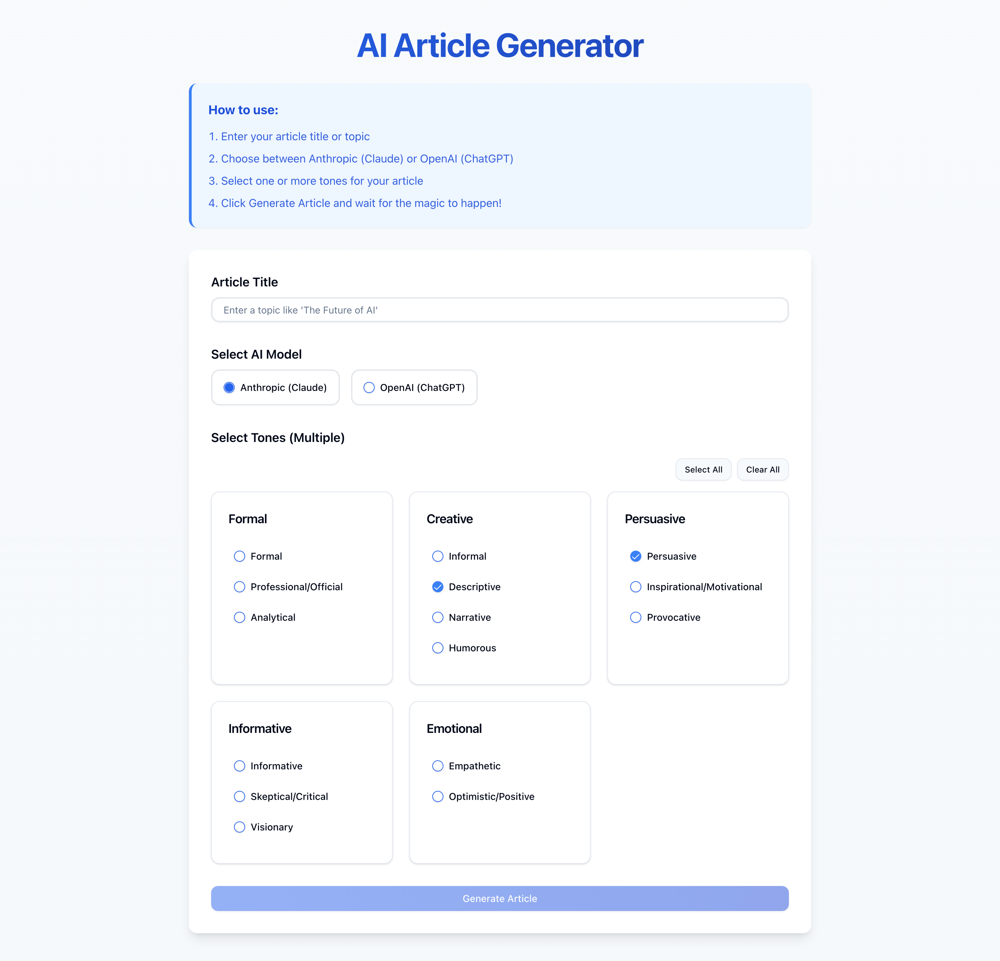

# AI Article Generator

A modern web application that generates high-quality articles using AI models (Claude and ChatGPT) with customizable tones and styles.



## Features

- 🤖 Multiple AI Models Support (Anthropic Claude & OpenAI ChatGPT)
- 🎨 Customizable Article Tones
- ✨ Modern & Responsive UI
- 📋 One-Click Copy to Clipboard
- 🎯 Multiple Writing Styles:
  - Formal & Professional
  - Creative & Narrative
  - Persuasive & Inspirational
  - Informative & Analytical
  - Emotional & Empathetic

## Getting Started

### Prerequisites

- Node.js 18+ 
- npm or yarn
- OpenAI API Key (for ChatGPT)
- Anthropic API Key (for Claude)

### Installation

1. Clone the repository:
```bash
git clone https://github.com/yourusername/article-generator.git
cd article-generator
```

2. Install dependencies:
```bash
npm install
# or
yarn install
```

3. Create `.env.local` file and add your API keys:
```env
OPENAI_API_KEY=your_openai_api_key
ANTHROPIC_API_KEY=your_anthropic_api_key
```

4. Run the development server:
```bash
npm run dev
# or
yarn dev
```

5. Open [http://localhost:3000](http://localhost:3000) with your browser to see the application.

## Usage

1. Enter your article title or topic
2. Choose between Anthropic (Claude) or OpenAI (ChatGPT)
3. Select one or more tones for your article
4. Click Generate Article and wait for the magic to happen!

## Tech Stack

- Next.js 15
- TypeScript
- Tailwind CSS
- Shadcn UI
- OpenAI API / Anthropic API

## Contributing

Contributions are welcome! Please feel free to submit a Pull Request.

## License

This project is licensed under the MIT License - see the [LICENSE](LICENSE) file for details.
